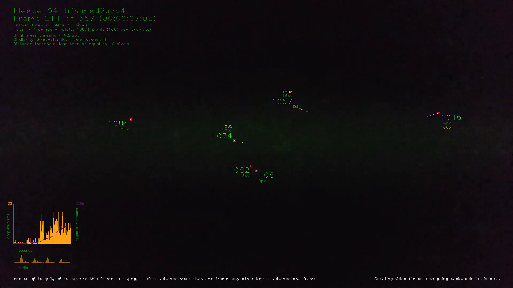
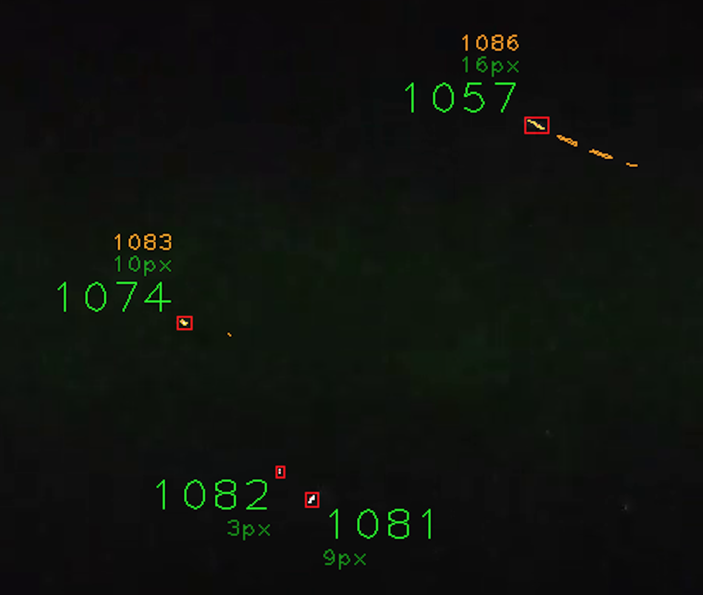
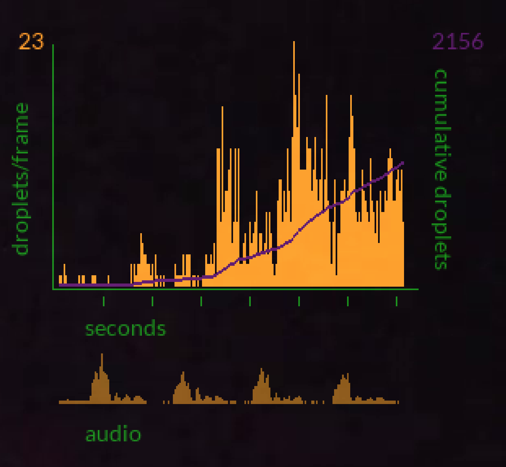

<!--

# Copyright (c) 2020 Fredrick Levine
# rick@xoab.us
#
# This file is part of Droplet Video Analyzer
# https://github.com/rlevine/droplet_video_analyzer
#
# This program is free software; you can redistribute it and/or modify
# it under the terms of the GNU General Public License as published by
# the Free Software Foundation; version 2.
#
# This program is distributed in the hope that it will be useful,
# but WITHOUT ANY WARRANTY; without even the implied warranty of
# MERCHANTABILITY or FITNESS FOR A PARTICULAR PURPOSE.  See the
# GNU General Public License for more details.
#
# You should have received a copy of the GNU General Public License
# along with this program; if not, see <http://www.gnu.org/licenses/>.

-->

  

# Droplet Video Analyzer

A python program to implement the video analysis techniques described in the paper
[Low-cost measurement of facemask efficacy for filtering expelled droplets during speech](https://advances.sciencemag.org/content/6/36/eabd3083)
by Emma P. Fischer, Martin C. Fischer, David Grass, Isaac Henrion, Warren S. Warren and Eric Westman
of Duke University.


This is a first pass at a script to extract droplet counts and sizes from video files
created with the laser testing device described in the paper. The implementation is based on
the description in the paper. For testing, I've used the [video files](https://research.repository.duke.edu/concern/datasets/qv33rx287?locale=en) published by the Duke
team.
 

## Installing / Getting started

The project is still in the early stages, and is not set up as a python package. 
I've included a conda environment specification to bootstrap a working environment quickly.

All development so far has been on OSX Mojave 10.14; nothing here has been tested on Windows or Linux.

If you don't already have Conda installed, you can find an OSX installer package for the 
Miniconda package manager here: https://repo.anaconda.com/miniconda/Miniconda3-latest-MacOSX-x86_64.pkg

(Other builds are here: https://repo.anaconda.com/miniconda/)

With Miniconda installed, in a terminal window, go to the destination directory you've 
chosen for the code and clone the repository:

```shell
git clone https://github.com/rlevine/droplet_video_analyzer.git
```

Go to the top level directory of the cloned code:

```
cd droplet_video_analyzer
```

If you're running on OSX, I've provided a slightly easier way to get started.

### OSX

You should see `spec-file.txt` in the top-level directory of the distribution.
that directory. Use conda to download the set of packages needed by the virtual 
runtime environment for the script:

```shell
conda create --prefix ./envs --file spec-file.txt
```

It will ask you to confirm overwriting the empty `envs` directory. Do so, and then activate the conda virtual environment from the that directory:

```shell
conda activate ./envs
```

Note that this runtime environment is isolated from any other python environment you have
on your computer, and will run packages and executables from the `envs` directory. Any other
packages you install with conda or pip will land in the `envs` directory tree. At any time, when you're
done working with this code, you can exit the conda virtual environment by typing

```shell
conda deactivate
```

### Any other OS

If you're running on Windows or Linux, you'll have to install packages for your OS.
(And again, this code has only been tested on OSX 10.14.)

First, create and activate a conda environment for the install. (This uses python 3.7,
as I haven't found a widely-distributed build of opencv 3.4 for python 3.8.)

```shell
conda create --name maskvideo python=3.7.9
conda activate maskvideo
```

Then, install these packages:

```
conda install -c conda-forge numpy
conda install -c conda-forge opencv=3.4.2
conda install -c conda-forge ffmpeg=4.0.2
conda install -c conda-forge ffmpeg-python Pillow scipy scikit-image prettytable ansi2html
```

By default, the conda forge `opencv` build for OSX brings in `ffmpeg 4.0`, which doesn't include
H.264 video encoder support, so I'm forcing an update to `ffmpeg 4.0.2`. An H.264 codec is needed
for writing and converting video files. `opencv 4` seems to have problems with positioning large
video preview windows, so I'm using `opencv 3.4.2`.

As with the OSX instructions, above, running `conda deactivate` will "turn off" the selected
conda virtual environment.


### Basic usage

You can run the script from the top directory of the distribution. For instance, to
analyze the test video file included in the distribution:

```
./dva -i sample_files -f Fleece_04.mp4
```
The script will create the directory `output` in the source directory, containing an annotated
video file and a .csv file with droplet data from the analysis.

```
./dva -i sample_files -f Fleece_04.mp4 --show-video
```
Adding the `--show-video` flag will turn on an interactive video window.

```
./dva -i sample_files -f Fleece_04.mp4 --show-video --not-interactive
```
Specifying `--not-interactive` will advance through frames in the video window
without requiring a keypress to advance frames.

When running the above examples, an annotated video file and .csv data file will be created in
the `sample_files/output` directory in the file tree.

### Interactive Video Window and Annotated Video



The video window displays all discovered droplets in a frame. In default interactive mode:

 - Pressing one number key or two number keys in quick succession will advance that many frames.
 - `back arrow`, `<` or `,` will move one frame backwards (Note: this is disabled when capturing video.)
 - `c` will capture a .png image of the frame to disk.
 - `+` or `-` will increase or decrease the detection threshold used to isolate droplets, to aid
 in finding the best threshold for a video. (This is also disabled when capturing video.)
 - Pressing any other key will advance one frame.



Droplets are assigned unique numbers during the detection process.  Their contours are shown in white,
with a red bounding box, and pixel size is annotated. Droplets discovered to be repeat appearances from
a prior frame show the prior "parent" droplet number and their unique ID is show in yellow. The history
trail of repeat droplets is also shown in yellow.



Each frame includes a cumulative graph showing droplets per frame, cumulative droplets detected,
and a synchronized audio graph. Note that the graph currently shows all droplets detected, before winnowing for
duplicates.


### Command Line Parameters

#### Input/Output

```
  -f <file name> [<file name> ...], --file <file name> [<file name> ...]
                        video files to analyze, either absolute or relative
                        paths
  -o <output directory>, --output-dir <output directory>
                        directory for all file output (optional; default will
                        create "output" in video source dir)
  -i <input directory>, --input-dir <input directory>
                        video source directory (optional; default is user's
                        home directory)
```

Input and output directories and source file names are specified separately in the
interface, with defaults.


####  Droplet Detection


```
  -t <detection threshold>, --threshold <detection threshold>
                        droplet detection threshold; default=62
```

The analysis process converts each video frame to grayscale, and then thresholds
each image, ignoring each pixel that isn't brighter than the supplied threshold.
This allows us to ignore background light scatter and other light artifacts that
might not be droplets. The threshold value is an 8-bit pixel brigtness, ie from 0 to 255.
Any pixels dimmer than this value will be ignored.

```
  -b <border width>, --border <border width>
                        width of border region of frame to ignore, in pixels;
                        default=20
```
We can ignore detections at the edges if a video frame, if there are
droplets or dust particles that remain in circulation because of airflow or
other reasons.

```
  --droplet-similarity <similarity threshold>
                        droplet similarity threshold; smaller is more similar;
                        default=30
  --distance-threshold <distance threshold>
                        absolute distance threshold; greater than overrides
                        similarity; default=40
  --frame-history <frame history>
                        number of frames to consider for prior droplet
                        similarity; default=1
```

The script uses three factors to try and determine if a droplet detection in
a given frame is a new droplet, or another sighting of an already-reported droplet
in a prior frame.

`--distance-threshold` is the maximum distance between a pair of droplet centroids
for them to be considered as duplicates.

In addition, I attempt to use Hu moment invariants calculated from the shape of
each droplet to identify duplicate droplets. This technique becomes less effective as droplet size decreases.

Multiplying droplet distance by the calculated moment similarity yields a confidence
factor. `--droplet-similarity` is the upper limit for that factor for droplets
in a frame series to be considered duplicates.

`--frame-history` is the number of prior frames to be examined for matches to droplets
in the current frame. I've found that looking at more than the most immediate prior
frame (`--frame-history` of 1) yields too many false positives in many circumstances.


```
  --top-10              generate image files for the top 10 frames by droplet
```

`--top-10` was implemented as way to capture .png images of the frames with the
highest numbers of droplets.


#### Output Options

```
  --no-csv              don't create a .csv data file
  -c, --no-video-output
                        don't create a new video file with annotation
  -l, --capture-log     create an HTML log file
  -q, --quiet           suppress console window output
```

By default, the script will save an annotated video file with droplets identified
and a graph of droplet detections over time, as well as a .csv file with data on
all detected droplets for analysis. In addition, the script will write extensive
progress information to the shell it's running in.

Progress output and video and .csv file generation can be turned off and creation
of a detailed log file can be turned on.

```
  --show-video          show video preview image while processing file
  -n, --not-interactive
                        do not require keyboard interaction to advance to next
                        frame
```
The script can display an interactive video window showing the progress of droplet detection,
frame by frame. By default, you'll need to press keyboard keys to advance the video.
Use `--show-video` to turn on the preview window, and `--not-interactive` to tell it to
run without needing keyboard interaction to advance from frame to frame.


#### Advanced options

```
  --apply-corrections   apply droplet corrections from file
                        <video_source>.corrections
```
The script will typically miscategorize 2 to 2.5% of droplets as being unique when they're
really a reappearance of a prior droplet. If more accuracy is needed, corrections can be provided
to the process by adding droplet numbers to a correction file for a specific video. The script will
generate an empty correction file, with instructions for completing it in the source video directory.
If `--apply-corrections` is specified, the provided corrections will be applied.

```
  --hide-droplet-history
                        hide historical droplet outlines for chained droplets
                        in video output
```
This hides the yellow droplet history on the video output.
```
  --output-frames <output frames>
                        number of frames to duplicate for each source frame
```
To create slower output video, specifying a small number, usually from 1-4, will write that many
frames for each source frame, making the sequence take more time in playback. Audio will not
be included in the file.

```
  --no-audio            Do *not* copy source audio to annotated video output
                        file
```
Do not copy source audio to the video output file.

```
  -d, --debug           Print debug output to the terminal window

```
Provides additional console output, highlights the possible label areas for all droplets and
shows the droplet sequence for label positioning from the center of the frame.

```
 --test                Ignore command line parameters and read them from
                        utils.cl_args.get_test_args()
```
When debugging from an IDE, this makes it possible to use test parameters from a config
file when the script is run from the command line.


#### Option Summary

```
usage: dva [-h] -f <file name> [<file name> ...] [-o <output directory>]
           [-i <input directory>] [-t <detection threshold>]
           [-b <border width>] [--droplet-similarity <similarity threshold>]
           [--distance-threshold <distance threshold>]
           [--frame-history <frame history>] [--top-10] [--no-csv] [-c] [-l]
           [-q] [--show-video] [-n] [--apply-corrections]
           [--hide-droplet-history] [--output-frames <output frames>]
           [--no-audio] [-d]
```


## Contributing

This is early, alpha quality code. It's fine to contact me, Rick Levine, at rick@xoab.us with
questions and suggestions. Pull requests are welcome, but an email with some
discussion is probably the best way to start.


## Licensing


Copyright &COPY; 2020 Fredrick Levine<br>
Email: rick@xoab.us

This program is free software; you can redistribute it and/or modify
it under the terms of the GNU General Public License, Version 2, as
published by the Free Software Foundation; ONLY Version 2 of the License.

This program is distributed in the hope that it will be useful,
but WITHOUT ANY WARRANTY; without even the implied warranty of
MERCHANTABILITY or FITNESS FOR A PARTICULAR PURPOSE.  See the
GNU General Public License for more details.

You should have received a copy of the GNU General Public License along
with this program; if not, write to the Free Software Foundation, Inc.,
51 Franklin Street, Fifth Floor, Boston, MA 02110-1301 USA.


